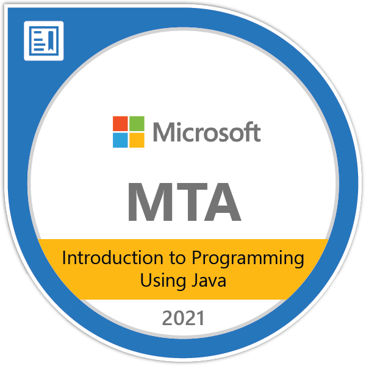
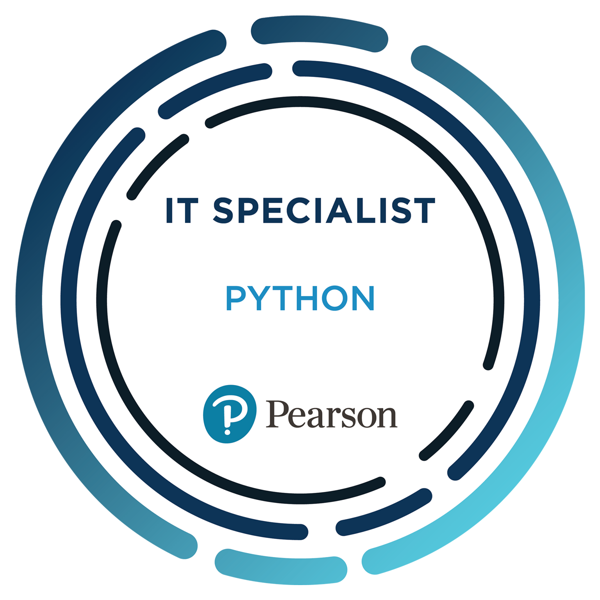

### Bio
- 👋 Hi, I’m Ivan Dominic G. Albano
- 👀 I’m interested in Java, C++ and Python programming
- 🌱 I’m currently learning kotlin language
- 💞️ I’m looking to collaborate on kotlin based projects
- 📫 How to reach me is https://www.facebook.com/ivan.albano777

### Badges

### Github Stats

<!---
CodesNiAyban/CodesNiAyban is a ✨ special ✨ repository because its `README.md` (this file) appears on your GitHub profile.
You can click the Preview link to take a look at your changes.
--->
